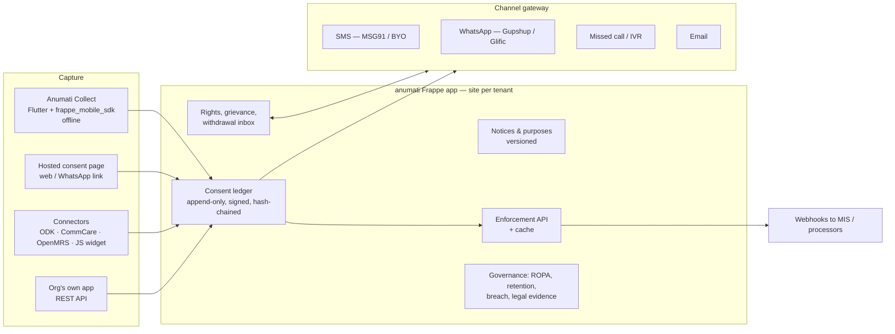

# Anumati — Product Specification v0.3

Sep 27, 2026 · @Sunandan

**Handoff pack for Claude Code:** this spec (behaviour, data, security, APIs) plus the clickable [Anumati Prototype](https://claude.ai/artifact/NdJy6NmaZT41fZHY4eKVuM) (look, copy, flows and interactions across eight surfaces). Where they disagree, the prototype wins on UX and copy; this spec wins on data, rules and security. The earlier [v0.2 wireframe canvas](https://claude.ai/artifact/GmdeEvigedcdpyvpgNYnMy) is superseded and kept for reference only. All numbers, names and organisations in the prototype are sample data.

## 1. Context and decisions

Anumati is an open-source, field-first DPDP consent platform for nonprofits, built as a Frappe app plus Dhwani's Frappe Mobile SDK, released under AGPL and offered as a hosted subscription (the ODK / Glific model).

**Why it exists.** The consortium sheet shows commercial CMPs (Consently, Concur, Consentin, ConsentiQo, IDS) cover notice and audit but not offline capture, assisted consent, PwD guardians, embedding or legacy true-up, and their per-consent pricing breaks at nonprofit volumes (e.g. \~₹8L yr-1 for 1 app / 1 lakh principals). TSI DPDP CMS is open source and strong on back office, but leaves the beneficiary-facing capture layer, mobile and offline to each organisation.

**Decisions taken**

| # | Decision | Rationale |
| --- | --- | --- |
| D1 | Build the server as a Frappe app (`anumati`), not a fork of TSI | One stack with mGrant and the mobile SDK; Frappe gives auth, RBAC, site-per-tenant, REST, versioning, translations |
| D2 | Use TSI (Apache 2.0) as the reference for data model and back-office features; port with attribution | Avoid re-inventing ROPA, grievance, breach, legal evidence, purge lifecycle |
| D3 | Field capture app = mForm on `frappe_mobile_sdk` ("Anumati Collect") | SDK already has outbox, idempotency, attachment pipeline, offline translations |
| D4 | Consent events are append-only; withdrawal is a new event | No merge conflicts; tamper-evident chain |
| D5 | Three integration tiers on one backend: full-stack, API-only, connectors | Serves NGOs with no IT and those with ODK / CommCare / OpenMRS / own apps |
| D6 | Verification and withdrawal are multi-channel and configurable per programme | Rural beneficiaries: shared phones, no phone, no data, low literacy |
| D7 | Licence: server AGPL-3.0, SDK MIT (as today), connectors MIT | Protects hosted business; keeps embedding friction low |
| D8 | Revenue from hosting, onboarding, DLT/template setup, language packs, connectors, support — priced per org / programme, not per consent | Consortium constraint: volume scales with people served, not revenue |

**Added in v0.3 (from the prototype)**

| # | Decision | Rationale |
| --- | --- | --- |
| D9 | Eight surfaces: public website, NGO console, analytics, field app, beneficiary touchpoints, developer portal, Dhwani platform console, auditor & partner portal | Each audience gets its own view of the same records; see section 3a |
| D10 | Brand: fingerprint अ logo, Maina the mynah mascot, single-line illustrations, rural-warm palette (sand, terracotta, leaf) | Grounded in the field; mascot avoids depicting any one region, caste or gender; see section 12 |
| D11 | Public website makes no claims based on third-party or internal research; figures on it are either Anumati’s own or clearly marked samples | The consortium comparison was internal research by another organisation |

**What changes from the v0.1 prototype.** Keep the admin shell (dashboard, programmes, template builder, audit, API keys, settings). Add: capture modes beyond OTP, offline states, assisted and guardian flows, multi-channel withdrawal, data-principal rights, grievance, legacy true-up, enforcement check, processor routing, breach, and the field app. Hosting becomes "hosted or self-hosted", not AWS-only.

**Out of scope for v1:** acting as a registered Consent Manager under the DPDP Rules, payments, cross-border transfer workflows, a generic form builder.

## 2. Personas and beneficiary segments

Anumati serves five operator roles and seven beneficiary segments; every capture and withdrawal flow must work for the hardest segment, not the easiest.

**Operator roles (Frappe roles)**

| Role | Where they work | Can do |
| --- | --- | --- |
| Org Owner / Admin | NGO console | Org setup, programmes, users, billing, API keys, integrations |
| DPO / Compliance | NGO console | Notices, purposes, ROPA, audit, grievances, rights requests, breach, legal evidence, reports, audit shares |
| Operator | NGO console (inbox only) | Work assigned rights requests and withdrawals; cannot change notices or settings |
| Programme Manager | NGO console + analytics | Programme templates, languages, field teams, campaigns, dashboards |
| Field Worker (CRP, ASHA, surveyor) | Anumati Collect app | Capture consent (self / assisted / guardian), log withdrawals and requests, offline |
| Developer / Integrator | Developer portal | Keys and scopes, webhooks, connectors, sandbox consent check |
| Auditor / Board reviewer | Auditor portal (read-only, time-limited link) | View audit pack, verify the chain, look up a consent code; names hidden |
| Processor partner (e.g. District Health Office, bank) | Partner portal | See withdrawals and erasures routed to them; confirm action taken |
| Funder viewer (CSR, foundation) | Analytics — funder roll-up | Aggregate consent posture across consenting grantees only; never beneficiary data |
| Platform Operator (Dhwani) | Platform console | Provision organisations, pooled SMS/WhatsApp, language packs, health, backups |

**Beneficiary (data principal) segments**

| Segment | Reality in the field | Design implication |
| --- | --- | --- |
| S1 Literate, own smartphone, data | Minority in rural programmes | Self-serve web / WhatsApp link, online OTP |
| S2 Feature phone, signal, no data | Very common | Native SMS OTP, SMS keywords, missed call, IVR |
| S3 Shared household phone | Common for women, elderly | Phone number is not identity; record "phone owner relation"; avoid OTP as sole proof |
| S4 No phone | Common among the poorest | Assisted capture, physical slip, helpline via worker or community point |
| S5 Low literacy / cannot read the notice | Common | Audio notice in own language, pictorial cards, witness, thumbprint |
| S6 Minor (<18) | Education, health, scholarship programmes | Verifiable guardian consent before any processing; no profiling |
| S7 Person with disability / lawful guardian | Health, livelihood, social protection | Record guardian type and appointment evidence (Rule 11) |

A single person can sit in several segments (e.g. S3 + S5 + S6). The capture flow picks modes from the segment flags, not the other way round.

## 3. Architecture and integration tiers

One Frappe backend (`anumati` app, one site per tenant) serves every channel; capture surfaces and connectors are thin clients that post append-only consent events to it.

**Components**

| Component | Tech | Owns |
| --- | --- | --- |
| `anumati` server | Frappe v15/16 app, MariaDB, Redis, RQ workers | All DocTypes in section 7, APIs, jobs, signing |
| Anumati Collect | Flutter app on `frappe_mobile_sdk` + consent widget pack | Offline capture, assisted/guardian flows, physical requests, intent API for other apps |
| Channel gateway | Frappe module with pluggable providers | Outbound SMS/WhatsApp/email/IVR; inbound keywords, missed calls, replies |
| Hosted consent page | Frappe web page (Jinja + vanilla JS), PWA-capable | Self-serve consent, preference centre, rights portal |
| Connectors | Per-platform packages | ODK/CommCare intent + Central sync; OpenMRS O3 widget + module; JS widget |

**Integration tiers**

| Tier | For | NGO effort | What Dhwani ships |
| --- | --- | --- | --- |
| T1 Full stack | NGOs with no IT system | Configuration only | Hosted tenant + Anumati Collect (optionally white-labelled) + hosted page + channels |
| T2 API only | Orgs with developers | Weeks | REST API, webhooks, sandbox, docs (TSI model) |
| T3 Connectors | ODK, CommCare, OpenMRS, web apps, Frappe/mGrant | Hours to days | Intent hand-off, XLSForm template, Central sync, O3 widget, JS checkout widget, native Frappe hooks |

**Deployment modes.** Hosted multi-tenant (Dhwani, India region), dedicated hosted tenant, or self-hosted via Docker Compose / bench. Same code in all three.

## 3a. Product surfaces

Eight surfaces read and write the same records; the prototype’s “View as” bar switches between them, and an action in one shows up in the others (for example an SMS STOP appears in the inbox, the principal record, the developer consent check and the audit log).

| Surface | Users | Screens (all built in the prototype) | Built with |
| --- | --- | --- | --- |
| Public website | NGOs, funders, developers | Home, How it works, For NGOs, Open source, Pricing, Talk to us | Static site (`anumati_site`), reusing prototype markup and art; no personal data |
| NGO console | Admin, DPO, operator, programme manager | Dashboard; Programmes (Overview, Notice & purposes, Capture & verification, Withdrawal channels, Field team, Integration); Notices (Purposes, Notice content with Rule 3 checklist, Translations, Versions, live phone preview in 3 languages); Campaigns (list, detail, 5-step wizard, auto triggers); Principals (search, record, timeline); Inbox (filters, shared-number matching, erasure fulfilment); Channels (Messaging, Capture & connectors, Devices, Message templates); Audit & governance (Audit log, Retention, Processors, ROPA, Breach, Access log); Settings (Organisation, Team & roles, Branding, Plan) | Frappe Desk for lists and forms; custom Frappe pages for dashboard, notice builder, inbox, principal timeline, campaign wizard |
| Analytics | Programme manager, DPO, funder viewer | Overview, Verification, Withdrawals & rights, Languages & districts, Field team, Funder roll-up; filters for period and programme | Frappe page with SVG/Chart.js charts over aggregate queries |
| Field app | Field worker | Home & sync, Beneficiary + segment flags, Guardian, Notice (audio-gated), Choices, Evidence, Verify offline, Receipt, Log a withdrawal | Flutter on `frappe_mobile_sdk` (Anumati Collect) |
| Beneficiary touchpoints | Data principal | SMS receipt + STOP + missed-call path, WhatsApp menu, printed receipt with tear-off slip, web preference centre, hosted consent page | Channel gateway templates; Frappe web pages (PWA) for preference centre and hosted page |
| Developer portal | Integrators | Quickstart (cURL, Python, Node, ODK XLSForm), API reference, Webhooks log, sandbox consent check, Keys & scopes | Frappe web page + OpenAPI spec |
| Dhwani platform console | Platform operator | Organisations (list + provision), Usage & messaging, Language packs, Health | `anumati_platform` Frappe app on a control site |
| Auditor & partner portal | Auditor, processor partner | Audit pack with chain verification, consent-code lookup (names hidden), partner confirmations | Frappe web pages behind signed, expiring links |

**Analytics metrics** (all aggregates, no personal data on screen): consents recorded and confirmed per week; confirmation rate; verification funnel (captured → recorded → confirmed → unconfirmed after N days); method that confirmed consent; capture mode mix; segment share (needs reading help, shared phone, no phone, minor); withdrawals per week and by channel; rights requests by type with on-time rate and median days; consents by language and district; per-worker volume, mode mix and “notice played in full” rate (a coaching flag, not a penalty); funder roll-up per grantee: programmes, confirmed rate, requests on time, chain status, reviewed languages.

## 4. Functional requirements

All 21 consortium requirements are in v1 scope; 13 are marked Must by every responding organisation (# Must = 5) and are P0. TSI status is from the consortium sheet's "TSi Readiness" column.

| Ref | Requirement | # Must | TSI | Anumati approach | Pri |
| --- | --- | --- | --- | --- | --- |
| A1 | Notice in all 22 languages, human-reviewed | 5 | Partial | Translation per notice version with reviewer sign-off field; shared language pack; audio notice per language | P0 |
| A2 | Standalone plain-language notice | 5 | Met | Notice DocType: items + purposes, separate from T&Cs, rendered before consent | P0 |
| A3 | Read-before-consent | 4 | App | Consent controls locked until notice scrolled to end or audio played to end; timestamp stored | P0 |
| A4 | Granular per-purpose, no dark patterns | 5 | Partial | Toggles default off; Accept all / Decline all equal weight; essential purpose separate | P0 |
| A5 | Offline / multi-touchpoint capture | 5 | App | Anumati Collect on SDK outbox; idempotent event UUID; device + server timestamps | P0 |
| A6 | Language of choice across the journey | 5 | Partial | `preferred_language` on principal; used for notice, SMS, IVR, portal; stored in each event | P0 |
| A7 | Assisted consent for low literacy | 5 | Not met | Capture modes: verbal (audio), thumbprint photo, witnessed; worker attestation + witness record | P0 |
| B1 | Structured, signed consent artefact | 4 | Met | Consent Event with Ed25519 server signature over canonical JSON; verify endpoint | P0 |
| B2 | Tamper-evident audit log | 5 | Met | Per-tenant hash chain over events and audit entries; chain verifier; export | P0 |
| B3 | Notice versioning and re-consent | 5 | Met | Semantic version; material change flag triggers re-consent campaign | P0 |
| B4 | Withdrawal and preference centre | 5 | Met | Multi-channel withdrawal (section 6); no more steps than grant | P0 |
| B5 | Data-principal rights workflow | 5 | Partial | Rights Request DocType: access, correction, erasure, grievance, nomination; SLA timers | P0 |
| B6 | Enforcement gate before processing | 5 | App | `check` API < 50 ms p95 from cache; SDK offline cache; webhooks on change | P0 |
| C1 | Verifiable guardian consent — minors | 4 | Partial | Guardian link + verification method + evidence; child flag disables profiling purposes | P0 |
| C2 | Guardian consent — PwD | 4 | Not met | Guardian type (family / court / committee), order upload, authority reference | P1 |
| C3 | Legacy / true-up consent | 3 | Bulk upload | True-up campaign: import principals, send notice, track fresh opt-in or refusal branch | P1 |
| C4 | Refusal handling and legal hold | 0 | Met | Refusal outcome: legitimate use / legal retention / hold period; reviewable | P1 |
| C5 | Security safeguards | 5 | Partial | See section 9 | P0 |
| C6 | Purpose-limited retention and erasure | 5 | Partial | Retention per purpose; nightly job flags expiry; advance notice; purge requests to systems | P0 |
| C7 | Third-party / processor routing | 4 | Partial | Processor registry; withdrawal and erasure fan-out with acknowledgement tracking | P1 |
| C8 | Exportable audit and reporting | 1 | Met | Audit pack (PDF + JSON + chain proof); live posture dashboard | P1 |

**Carried over from TSI (parity features)**

| TSI feature | In Anumati | Pri |
| --- | --- | --- |
| ROPA authoring + DPIA fields | ROPA DocType linked to purposes | P1 |
| Grievance management with statutory timelines | Part of Rights Request | P0 |
| Breach notification + DPB-ready report + bulk notify | Breach Incident DocType + channel fan-out | P1 |
| Legal evidence certificate (BSA s.63) | Evidence Certificate from chain segment | P2 |
| Purge lifecycle + webhooks / polling | Purge Request + acknowledgement | P0 |
| Operator delegation (DPO → operator) | Frappe roles + assignment | P1 |
| Voice consent (Sarvam TTS/STT) | IVR + audio notice; STT optional | P2 |
| Portable consent artefact / wallet | Downloadable signed artefact + QR | P2 |
| White-labelling | Per-tenant branding, no length cap | P1 |

**New in Anumati (not in TSI or CMPs):** capture modes and offline verification (section 5), multi-channel withdrawal inbox (section 6), physical slip workflow, true-up campaigns, connectors, and verification status tracking.

## 4a. Coverage audit (v0.2.1)

Checked against all four tabs of the consortium sheet, the 8 commercial-CMP criteria, and every API action in TSI v0.5.1 (18 services, \~95 actions). Result: all 21 requirements and 9 context constraints are covered; 17 gaps were found and are now fixed in this spec; 11 TSI choices are deliberately changed or dropped.

**Consortium "Your context" constraints**

| Constraint | Orgs saying Yes | Where covered |
| --- | --- | --- |
| Offline / low connectivity | 6 | Anumati Collect, section 5 verification ladder |
| Embedded in own system | 4 | T3 connectors + intent hand-off, section 8 |
| Multiple Indian languages | 5 | A1/A6, Notice Translation, language pack |
| Low literacy / assisted | 4 | A7 capture modes, audio notice, M5 |
| Guardian — minors | 4 | C1, Guardian Link, guardian step (prototype: Field app › Guardian) |
| Guardian — PwD | 4 | C2, same |
| Legacy true-up | 5 | C3, Campaigns (prototype: Console › Campaigns) |
| Sustainable pricing | 5 | D8, per-org pricing; open decision in section 11 |
| Self-hosting / residency | 4 | Deployment modes, section 3 |

**Commercial CMP criteria (from the comparison tab)**

| Criterion | Best vendor offer | Anumati | Status |
| --- | --- | --- | --- |
| 22 languages | Consently, ConsentiQo claim all 22 | 22 with human review + audio | Covered |
| Embeddability | Web snippet, Android SDK | Intent hand-off, REST, JS widget, ODK/CommCare/Frappe connectors | Covered; web cookie banner added (gap 15) |
| Patient / offline consent | ConsentiQo: offline "possible" | Offline-first with verification ladder | Covered, stronger |
| Minors and PwD | DigiLocker parent verification; PwD nowhere | Guardian types + evidence; DigiLocker added as a method (gap 5) | Covered |
| Artefact and audit | Timestamp + IP, CSV/JSON/PDF export, 7-yr retention | Signed events, hash chain, CSV/JSON/PDF, configurable retention (gap 11) | Covered |
| Withdrawal / preference centre | Self-service centre | 11 channels + inbox + preference centre | Covered, stronger |
| Deployment and residency | India SaaS; Consentin on-prem | Hosted India + self-host; onboarding target ≤ 1 week for T1 | Covered |
| Cost | ₹1.2L–₹15L/yr, per-consent tiers | Open source + per-org hosting | Covered |

**TSI feature inventory → Anumati**

| TSI service (actions) | In Anumati | Change |
| --- | --- | --- |
| Policy (create, publish, versions, active by jurisdiction) | Notice Template + Translation | Built in a form builder, not hand-compiled JSON |
| Consent (record, parent consent, active, history, validate, withdraw, erasure, **link\_user**) | Consent Event, Consent State, `check`, `principal.link` (gap 1) | Append-only events |
| consent\_validations (which app checked which purpose) | **System Usage Log** (gap 2) | Used to route purge only to systems that used the data — adopted from TSI |
| Principal (login, OTP, personas) | Preference centre login; `persona` on Programme (gap 3) | OTP stored in Redis with TTL, not memory |
| Grievance (submit, assign, status, user list) | Rights Request | Same inbox as withdrawals |
| Compliance / CES (purge initiate, assign, status; nightly retention purge) | Purge Request + retention job | Same |
| Breach (report, affected principals, CSV bulk notify, DPB PDF) | Breach Incident | Same, plus SMS/WhatsApp/IVR fan-out |
| Ropa (create, publish, retire, derive from policy, validate completeness, export) | ROPA Entry with derive + completeness check (gap 4) | Same |
| Legal (BSA s.63 evidence certificate) | Evidence Certificate | P2 |
| Notification (list, mark read, message templates, webhook config, rights-app config) | Webhooks + **notification polling feed** (gap 6) + **Message Template per event × language** (gap 7) | Same |
| Job (bulk jobs, downloads) | RQ jobs + **Job & Export log** screen (gap 8) | Same |
| AdminDash (metrics, **access logs**) | Dashboard + **PII Access Log** (gap 9) | Same |
| ApiKey (generate, revoke, status) with scopes | API keys per programme with **scopes** (check-only vs write) (gap 10) | Same |
| App (per fiduciary) | **Source System** registry (gap 2) | Same |
| Operator (login, recovery keys, users) | Frappe users + mandatory 2FA for Admin/DPO | Drop master recovery keys |
| Fiduciary (+ DNS domain validation), Consent Manager aggregator mode | Tenant = one org | Dropped: Dhwani is not a registered Consent Manager |
| Wallet / Portable Consent Artefact | Downloadable signed artefact + QR | Wallet dropped for v1 |
| Voice consent (Sarvam) | Audio notice + IVR; STT optional | P2 |
| White-label (12-char cap) | Per-tenant branding | Cap dropped |

**TSI choices we deliberately change**

| TSI does | Why it doesn't fit | Anumati does |
| --- | --- | --- |
| One mutable "active" consent row per user, flipped on change | Weak evidence trail; conflicts with offline sync | Append-only signed events + projection |
| `ip_address` NOT NULL on consent | Offline capture has no IP | Device ID + device and server time; IP optional |
| No assisted, witness or capture-mode fields | Fails A7 | Capture modes + evidence |
| Beneficiary UI left to each app; demo pages only | Every NGO rebuilds the hardest part | Anumati Collect + hosted page + connectors |
| Pending OTPs in server memory | Lost on restart, breaks multi-instance | Redis with TTL |
| Dummy OTP "1234" mode | Unsafe if left on | Sandbox tenants only |
| Policies compiled by engineers from a .txt questionnaire | NGOs have no engineers | No-code notice builder |
| Webhook-only SMS (org must run a relay) | NGOs can't run a relay | Built-in channel gateway |
| Consent Manager + DNS validation | Needs CM registration | Out of scope |
| Master recovery keys | Frappe already has reset + 2FA | Dropped |
| Security after the fact (auth bypass fixed in v0.5.1) | Trust product | Tests before features (section 9) |

**Gaps found and now fixed in this spec**

1. `principal.link` — link consent given before registration (hosted page) to the ID created later.
2. Source System registry + System Usage Log from `check` calls, used to target purge and withdrawal fan-out.
3. Persona on Programme (patient, student, employee) for orgs serving several principal types.
4. ROPA derive-from-purposes and completeness validation.
5. Guardian verification methods: device SMS OTP, DigiLocker parent verification, document upload, witness.
6. Notification polling feed as fallback for every webhook.
7. Message Template DocType (event × channel × language) with DLT template ID.
8. Job & Export log.
9. PII Access Log — who viewed which principal and when.
10. API key scopes.
11. Configurable retention of consent records themselves (default 7 years pending counsel).
12. Notice must carry Rule 3 contents: withdrawal method, rights, how to complain to the Board, DPO contact, security summary.
13. Notice copy delivered to the principal (SMS link, printed slip) — A3 "separate notice per data principal".
14. Minor turning 18: flag at 18, ask the principal for fresh consent, guardian consent lapses after grace period.
15. Web consent banner / cookie snippet for org websites (P2).
16. Principal de-duplication and merge, with event history carried over.
17. Consent validity period per programme (auto-renewal campaign before expiry).

**Still open (not fixable in spec):** consent for data about other household members collected in surveys; B6 "reflected everywhere immediately" cannot hold for devices offline — spec commits to next sync plus a device-cache TTL (default 24 h) after which the app re-checks before processing.

## 5. Consent capture and verification

Capture mode (who gives consent, how) and verification method (what proves it) are separate settings on each programme template, so any combination works offline.

**Capture flow (Anumati Collect and hosted page)**

1. Select or register principal (programme ID from host system, optional phone, segment flags: minor, PwD guardian, shared phone, no phone, needs assistance).
2. Choose language → stored as `preferred_language`.
3. Present notice: text + pictorial card + audio. Consent controls unlock only after scroll-to-end or audio-complete (A3).
4. Per-purpose toggles, all off; essential purpose explained separately (A4).
5. Guardian step if minor or PwD (C1, C2).
6. Capture evidence per mode; verification per method.
7. Save event locally → status `captured`; sync → server signs, chains → `recorded`; verification result → `confirmed` / `unconfirmed`.
8. Give the principal a receipt: SMS/WhatsApp when possible, else printed or handwritten slip with artefact short code and withdrawal channels.

**Capture modes**

| Mode | When | Evidence stored |
| --- | --- | --- |
| Self — digital | S1 on own device or hosted link | Toggle choices, device info, OTP or link token |
| Self — on worker device | Principal taps on worker's phone | Choices + worker ID + GPS (optional) |
| Assisted — verbal | S5, notice read aloud / played | Audio clip of affirmation (≤ 60 s), worker attestation |
| Assisted — thumbprint | S4/S5 | Photo of thumb impression on consent slip, worker attestation |
| Assisted — witnessed | Any assisted case per org policy | Witness name, relation, phone (optional), witness signature/thumb photo |
| Guardian — minor | S6 | Guardian link, relation, verification, evidence |
| Guardian — PwD | S7 | Guardian type (family / court / committee), order or authority ref, document photo |
| Paper then digitise | Camps with no devices | Scanned signed form, data-entry operator ID, later SMS confirmation |

**Verification methods by connectivity**

| Connectivity | Method | How it works | Result |
| --- | --- | --- | --- |
| Online | Server OTP (SMS/WhatsApp via gateway) | Standard send + verify | `confirmed` at capture |
| Signal, no data | Device SMS OTP | App generates 6-digit code, opens SMS app pre-filled to principal's number; worker taps Send; principal reads code back; app verifies locally (hash of code stored) | `confirmed` at sync |
| Signal on principal side | Reverse SMS / missed call | Principal sends `YES <code>` or gives missed call to org long code; server matches on sync | `confirmed` async |
| No signal | Deferred confirmation | Evidence captured; on sync server sends SMS/WhatsApp/IVR: "You consented on {date} to {purposes}. Reply NO / call {n} to withdraw" | `confirmed` on delivery report, or `unconfirmed` after N days |
| No phone | Evidence only | Assisted mode evidence + witness; printed receipt | `evidence_only` |

Policy per programme: which methods are allowed, whether processing may start before `confirmed` (default: yes for non-sensitive purposes, no for minors), and N days before `unconfirmed` escalates to the programme manager. Google Play restricts silent SMS sending, so the Play build uses the pre-filled SMS intent; a sideloaded build may send directly.

**Anumati Collect intent API (for T3 connectors).** Action `org.anumati.CAPTURE_CONSENT` with extras `programme`, `principal_ref`, `language`, `return_fields`; returns `consent_id`, `status`, `purposes_granted[]`. ODK uses `ex:org.anumati.CAPTURE_CONSENT(...)`; CommCare uses app callouts.

## 6. Withdrawal and rights channels

Every channel lands in one Withdrawal & Rights Inbox, is matched to a principal, verified to a level the channel allows, and propagates to enforcement and processors within one sync cycle; withdrawal must never take more steps than the original grant (S.6(4)).

**Channels**

| Channel | How the principal uses it | Identity match | Verification | Pri |
| --- | --- | --- | --- | --- |
| Field worker, in person | Tells any worker; worker logs it in Anumati Collect (works offline) | Principal lookup in app | Principal confirms on screen / thumb / witness | P0 |
| Physical slip / letter | Tear-off withdrawal slip on the consent receipt, or letter at office / drop box | Artefact short code or name + programme | Staff digitise, attach scan; SMS confirmation if phone | P0 |
| SMS keyword | `STOP <code>` or `STOP` to org long code / virtual number | Sender number → principal(s) | Number match; if shared number maps to many, reply with menu | P0 |
| Missed call | Missed call to a dedicated number | Caller number | Number match + call-back IVR or SMS confirm | P0 |
| IVR / helpline | Toll-free or local number, menu in own language; press 1 to withdraw | Caller number or artefact code via keypad | DTMF confirmation; recording stored | P1 |
| WhatsApp | Reply `STOP` to receipt, or chatbot menu (Glific / Gupshup) | WhatsApp number | Number match; per-purpose choice via buttons | P0 |
| Web preference centre | Link or QR on receipt; OTP login; per-purpose toggles | Phone / email / artefact code | OTP or code + DOB | P0 |
| Email | Reply to receipt or write to DPO address | Sender email | Email match; else manual review | P1 |
| Community point | SHG meeting, gram panchayat, CSC, camp desk logs on behalf | Artefact code or name | Assisted, witnessed | P1 |
| Via API / connector | Host system forwards a withdrawal it received | `principal_ref` | Host's attestation | P0 |
| USSD | Short code menu on feature phones | Caller number | Session | Later (operator cost) |

**Rules**

- Receipts always print or send: artefact short code (e.g. `AN-7K2Q`), the purposes, and the three cheapest withdrawal routes for that programme.
- Default withdrawal scope = all optional purposes; channels that support menus (IVR, WhatsApp, web, app) allow per-purpose withdrawal.
- Unmatched or ambiguous requests (shared number, unknown code) go to a review queue; SLA clock starts at receipt, not at match.
- On withdrawal: new Consent Event (`withdrawn`), enforcement cache invalidated, webhook `consent.withdrawn`, processor fan-out (C7), confirmation to principal in `preferred_language` on the channel used.
- Physical channels require a paper-trail number printed on slips so offline requests can be reconciled.

**SMS keywords** (inbound on the org long code; case-insensitive, Devanagari digits accepted): `STOP` or `STOP <code>` withdraws all optional purposes; `STOP <n>` withdraws purpose number n from her receipt; `DATA` sends a summary of what is held; `HELP` requests a call-back. Replies go out in her `preferred_language`.

**Other rights (B5) use the same channels and inbox**

| Right | Channels | Default SLA (configurable, confirm with counsel) |
| --- | --- | --- |
| Access / summary of data | Web, WhatsApp, field worker, letter | 30 days |
| Correction | Web, field worker, letter | 30 days |
| Erasure | All withdrawal channels | 30 days + purge ack from systems |
| Grievance | All channels + DPO email | 30 days, escalation to DPB guidance shown |
| Nomination | Web, field worker | On receipt |

## 7. Data model (Frappe DocTypes)

Thirty DocTypes (20 below + 6 added in v0.2.1 + 4 added in v0.3) in one `anumati` module; Consent Event and Audit Entry are insert-only (no edit, no delete, enforced in `validate` and permissions), everything else is normal Frappe CRUD with version tracking.

**Core**

| DocType | Key fields | Notes |
| --- | --- | --- |
| Anumati Settings (single) | org legal name, DPDP role, DPO, residency, signing key ref, default languages | Per tenant |
| Programme | name, status (Draft/Live/Paused), languages\[\], capture\_modes\[\], verification\_methods\[\], withdrawal\_channels\[\], allow\_processing\_before\_confirm, confirm\_window\_days | Replaces v0.1 programme card |
| Purpose | programme, code, title, description, essential (check), data\_items\[\], retention\_days, legal\_basis, sensitive, child\_allowed | Child-disallowed purposes auto-hidden for minors |
| Notice Template | programme, version (semver), status, material\_change, purposes (child table), summary, full\_text | Submittable; published versions immutable |
| Notice Translation | notice, language, summary, full\_text, audio\_file, pictorial\_card, reviewer, reviewed\_on, machine\_translated (check) | A1 sign-off lives here |
| Data Principal | principal\_ref (from host), name (optional, encrypted), phone\_hash + encrypted phone, email, preferred\_language, flags: minor, pwd\_guarded, shared\_phone, no\_phone, needs\_assistance, phone\_owner\_relation | Lookup by hash; PII encrypted at field level |
| Guardian Link | principal, guardian (Data Principal), type (parent/legal guardian/family PwD/court/committee), authority\_ref, evidence file, verification\_method, verified\_on | C1, C2 |
| **Consent Event** | event\_uuid (client-generated), principal, programme, notice + version, language, action (grant/withdraw/refuse/renew), purposes\_granted\[\], purposes\_denied\[\], capture\_mode, channel, captured\_by, witness, evidence files\[\], device\_time, server\_time, gps (opt), verification\_method, verification\_status, signature, prev\_hash, hash | Insert-only; unique on event\_uuid for idempotent sync |
| Consent State | principal, programme, purpose, status, last\_event, updated | Derived projection for fast enforcement; rebuilt from events |
| Verification Attempt | event, method, channel, sent\_at, delivered\_at, response, code\_hash, result | OTP, deferred SMS, missed call |

**Rights, channels, governance**

| DocType | Key fields |
| --- | --- |
| Rights Request | type (withdrawal/access/correction/erasure/grievance/nomination), channel, raw\_payload, matched\_principal, match\_confidence, status, assigned\_to, sla\_due, resolution, evidence |
| Channel Message | direction, channel, provider, from, to, template, body, status, linked request/event |
| Channel Provider | type (SMS/WhatsApp/IVR/missed call/email), provider (MSG91, Gupshup, Glific, Exotel, SMTP), credentials (password field), sender\_id, DLT entity id, templates\[\], pooled vs BYO |
| Processor | name, contact, webhook\_url, purposes\[\], DPA reference |
| Propagation Ack | processor, event or request, sent\_at, acked\_at, status |
| True-up Campaign | programme, source file, principals imported, notice, channels, stats (sent/opted-in/refused/no-response) |
| Retention Job Log / Purge Request | purpose, principal, due, notified\_on, purged\_on, system acks |
| ROPA Entry | purpose, categories, recipients, retention, safeguards, DPIA fields |
| Breach Incident | detected\_on, purposes affected, principals affected, notifications sent, DPB report file |
| Audit Entry | actor, action, doc ref, before/after hash, prev\_hash, hash |

**Hashing and signing.** `hash = sha256(canonical_json(event_without_sig) + prev_hash)`, chain per tenant, serialised through a Redis lock or DB sequence at insert. Server signs `hash` with a tenant Ed25519 key (key in site config or KMS). Device-side the SDK stores the unsigned event with `event_uuid`; server is the only signer.

**Added in v0.2.1 (from the coverage audit)**

| DocType / change | Key fields | Why |
| --- | --- | --- |
| Source System | name, type (Collect, ODK, CommCare, Frappe, web, API), programme, API key, purge endpoint | TSI "App" parity; purge targets |
| System Usage Log | source system, principal, purpose, checked\_at, result | Learned from `check` calls; routes purge and withdrawal only to systems that used the data (TSI consent\_validations idea) |
| Message Template | event, channel, language, body, DLT template ID, approved | Per-language receipts, confirmations, reminders |
| PII Access Log | user, principal, action (view/export), at, IP | Who viewed which beneficiary |
| Nominee (child of Data Principal) | name, relation, contact, evidence, nominated\_on | B5 nomination on death or incapacity |
| Job & Export Log | type, requested\_by, file, status | Bulk imports, notifications, audit packs |
| True-up Campaign → **Campaign** | type (true-up, re-consent, renewal, majority transfer), audience, channels, deadline, fallback outcome | One engine for all campaigns (prototype: Console › Campaigns) |
| Notice Template + | withdrawal methods, rights text, Board complaint route, DPO contact, security summary | Rule 3 notice contents |
| Data Principal + | date\_of\_birth or age band, persona, merged\_into | Turning-18 trigger, personas, de-duplication |
| Guardian Link + | verification\_method adds DigiLocker | Parity with commercial CMPs |
| Programme + | consent\_validity\_days, consent\_record\_retention\_years (default 7) | Renewal and record retention |
| Consent Event change | `ip_address` optional; `device_id` required for app captures | Offline capture has no IP |

**Added in v0.3 (from the prototype)**

| DocType | App | Key fields | Why |
| --- | --- | --- | --- |
| Field Device | anumati | device\_id, user, app\_version, last\_sync, pending\_events, status (active/logged-out/wiped) | Devices tab, remote logout, sync-lag alerts |
| Audit Share | anumati | scope (period, programmes), token hash, expires\_on, created\_by, names\_hidden (always on), access log | Auditor portal link, read-only |
| Funder Link | anumati | funder name, contact, grantee consent to share, metrics allowed | Funder roll-up shows aggregates only, and only for grantees who opt in |
| Language Pack Entry | anumati | language, key, text, audio, reviewer, version | Shared reviewed strings reused by every organisation |
| Tenant | anumati\_platform | org, site, plan, SMS mode (pooled/BYO), health, created | Platform console organisations list and provisioning |
| Usage Record | anumati\_platform | tenant, month, SMS, WhatsApp conversations, IVR minutes, cost | Pass-through billing at cost |

Campaign gains `trigger` (manual, material notice change, turning 18, validity expiry, retention notice) and `fallback_outcome` for no response or refusal.

## 8. APIs, webhooks and connectors

A versioned REST API under `/api/v2/method/anumati.api.v1.*`, authenticated by per-programme API keys (live/test) or OAuth for the mobile app; every write is idempotent on a client-supplied UUID.

**Endpoints**

| Method | Purpose | Notes |
| --- | --- | --- |
| `notice.get_active(programme, language)` | Current notice, purposes, translations, audio URLs | Cacheable; ETag |
| `consent.record(event)` | Grant / refuse / renew | Idempotent on `event_uuid`; returns signed artefact |
| `consent.withdraw(principal_ref, purposes?, channel)` | Withdraw | Same idempotency |
| `consent.check(principal_ref, purpose)` | Enforcement gate | < 50 ms p95; returns allow/deny + event id |
| `consent.state(principal_ref)` | All purposes for a principal | Preference centre and host UIs |
| `consent.verify(artefact)` | Verify signature and chain position | Public, rate-limited |
| `session.create(programme, principal_ref, return_url)` | Hosted consent page (checkout pattern) | Returns URL; redirect back with `consent_id` |
| `rights.submit(type, principal_ref, payload, channel)` | Rights request from host systems |  |
| `principal.upsert / link_guardian` | Principal and guardian records |  |
| `purge.list / purge.ack` | Erasure lifecycle for processors | Polling fallback to webhooks |
| `channel.inbound/<provider>` | SMS, WhatsApp, missed-call, IVR callbacks | Provider-signed; guest-allowed with HMAC check |

**Webhooks** (HMAC-SHA256 signed, retries with back-off, delivery log): `consent.recorded`, `consent.confirmed`, `consent.withdrawn`, `consent.expiring`, `rights.created`, `rights.closed`, `purge.requested`, `breach.notified`.

**Connectors (T3)**

| Connector | Mechanism | NGO-side effort | Pri |
| --- | --- | --- | --- |
| ODK Collect | XLSForm row with `ex:org.anumati.CAPTURE_CONSENT(...)` returns `consent_id`; optional ODK Central sync job links submissions | Add one row to form | P0 |
| CommCare | App callout to same intent | Configure callout | P1 |
| Frappe / mGrant | `anumati_client` app: Link field + `before_insert` enforcement hook | Install app | P0 |
| Web apps | Hosted consent page + `anumati.js` widget | Script tag + redirect | P1 |
| OpenMRS O3 | ESM microfrontend in patient chart + backend module calling `check` | Install module | Phase 2, co-build with Intelehealth |
| Generic Android | Same intent API; Kotlin helper library later | A few lines | P1 |
| Bulk / legacy | CSV import for true-up (C3) | Upload file | P1 |

**Added in v0.2.1:** `principal.link(temp_ref, principal_ref)` to attach consent given before registration; `notifications.list(since)` polling feed mirroring every webhook; `rights.fulfil(request, system, result)` for host systems to confirm access, correction or erasure; API key scopes `check`, `capture`, `rights`, `admin`; every `check` writes a System Usage Log row (sampled at 1-in-N above a configurable volume).

**Added in v0.3:** `posture.summary(funder_link)` returns aggregate metrics for opted-in grantees only; `audit_share.create(scope, days)` and `audit_share.verify_chain(token)` back the auditor portal; `processor.pending()` and `processor.confirm(request)` back the partner portal; `device.logout(device_id)` for remote logout; `tenant.provision(org, plan, sms_mode)` on the platform site.

## 9. Non-functional requirements

Security is the product: TSI shipped with unauthenticated admin pages and cross-tenant leaks until v0.5.x, so every item below has a test and ships before the first pilot.

| Area | Requirement | Acceptance |
| --- | --- | --- |
| Tenant isolation | One Frappe site per tenant (hosted); no cross-site queries | Automated test: tenant A key cannot read tenant B data on any endpoint |
| AuthN/Z | Server-side permission checks on every page and API; role matrix per section 2 | Unauthenticated `curl` on every route returns 401/403 (CI check) |
| Encryption | TLS 1.2+; MariaDB at-rest encryption; field-level encryption for name, phone, evidence files; phone lookups by salted hash | DB dump shows no plaintext PII |
| Device security | SQLCipher (or equivalent) for SDK local DB; evidence files encrypted; auto-purge synced evidence from device; remote logout | Lost-phone test: no readable consent data |
| Signing | Tenant Ed25519 key in site config or KMS; rotation with key ID in each event | Verify endpoint validates old and new keys |
| Audit | Hash chain over events and admin actions; nightly chain verification job with alert | Tampering one row fails verification |
| Performance | `consent.check` < 50 ms p95 from Redis projection; 100 events/s ingest per tenant | Load test report |
| Sync | Idempotent on `event_uuid`; out-of-order events resolved by `device_time` then `server_time` | Replay test: no duplicates, correct final state |
| Availability | Hosted: 99.5% monthly; daily encrypted off-site backups; RPO 24 h, RTO 8 h | DR drill once per quarter |
| Residency | Hosted in India region; self-host option | Documented in tenant settings |
| Languages | English + 22 Eighth Schedule languages for UI strings and SMS templates; human review flag; RTL for Urdu, Kashmiri, Sindhi | Consent flow completes in each language |
| Accessibility | WCAG 2.1 AA for web; large touch targets (≥ 48 dp), audio-first mode in app | a11y audit |
| Breach | Detection alerts; breach workflow produces notices within the configured window (72 h per Rules, confirm with counsel) | Simulated breach drill |
| Security review | External pen test (CERT-In empanelled) before GA; dependency scanning in CI | Report closed |
| Observability | Structured logs without PII; per-tenant metrics: captured / confirmed / withdrawn / SLA breaches | Dashboard |

## 10. Screen inventory

The [Anumati Prototype](https://claude.ai/artifact/NdJy6NmaZT41fZHY4eKVuM) is the screen inventory: 8 surfaces, 60+ working screens and tabs, one shared sample state. Build each screen to match it, then apply the rules in sections 4–9. The table maps every screen group to the requirements it proves.

| Surface › screen group | Requirements covered |
| --- | --- |
| Website › Home, How it works, For NGOs, Open source, Pricing, Talk to us | D9–D11, section 12 |
| Console › Dashboard | C8, B5, verification status |
| Console › Programme › Capture & verification | A5, A7, C1, C2, section 5 |
| Console › Programme › Withdrawal channels (+ receipt preview) | B4, section 6 |
| Console › Notices (purposes, Rule 3 checklist, translations, versions, live preview) | A1–A4, B3, gap 12 |
| Console › Campaigns (+ wizard, auto triggers) | B3, C3, C6, gaps 14 and 17 |
| Console › Principals › record (state, guardian links, nominee, signed timeline) | B1, B2, B5, C1 |
| Console › Inbox (filters, shared-number matching, erasure fulfilment with legal hold) | B4, B5, C4, C7 |
| Console › Channels (messaging, connectors, devices, message templates) | Sections 3, 6, 8; gap 7 |
| Console › Audit & governance (audit, retention, processors, ROPA, breach, access log) | B2, C5–C8, gaps 4 and 9 |
| Analytics (6 tabs incl. funder roll-up) | C8, section 3a metrics |
| Field app M1–M8 + guardian | A3–A7, C1, C2, section 5 |
| Beneficiary › SMS, WhatsApp, slip, preference centre, hosted page | A2–A4, B4, B5, section 6, gap 1 |
| Developer portal (quickstart, reference, webhooks, sandbox check, keys) | Section 8, gaps 6 and 10 |
| Platform console (organisations, usage, language packs, health) | Section 9, D8 |
| Auditor & partners (audit pack, lookup, confirmations) | B2, C7, C8 |

Still to design (use Frappe Desk defaults): breach report form, ROPA editor, IVR prompt recorder, new-programme wizard, principal merge. In the prototype these show a “opens here” message.

## 11. Phasing, build notes and open questions

Build in four phases; phase 1 ends with a pilot at one consortium NGO on Anumati Collect + ODK connector. Durations are rough estimates for 2–3 engineers using Claude Code, before security review.

| Phase | Scope | Exit gate | Rough effort |
| --- | --- | --- | --- |
| 0 — Foundations | Frappe app skeleton, DocTypes (section 7), signing + hash chain, tenant setup, role matrix, CI with auth/tenancy tests | Chain verifier and cross-tenant tests green | 2–3 weeks |
| 1 — Core capture (P0) | Notices + translations, programmes, consent API, enforcement check, Anumati Collect screens M1–M8 on SDK, device SMS OTP, deferred confirmation, SMS via MSG91, receipts, inbox with field worker / SMS / missed call / physical slip, ODK connector | Pilot: 500 real consents in 2 languages, offline, zero duplicate events | 8–10 weeks |
| 2 — Rights and channels | WhatsApp bot, IVR, email, preference centre, rights requests with SLA, guardian flows (C1, C2), processor routing, retention + purge, true-up campaigns, Frappe/mGrant client | All consensus Musts met in pilot NGO | 6–8 weeks |
| 3 — Scale and trust | External pen test, 22-language pack, CommCare, web widget, breach module, evidence certificate, hosted multi-tenant ops, self-host docs | GA; DPG application filed | 6 weeks |
| Later | OpenMRS O3 with Intelehealth, USSD, portable artefact wallet | — | — |

**Surfaces by phase:** Phase 1 — field app, console core (dashboard, programmes, notices, principals, inbox), SMS receipts and slips, developer portal basics, website. Phase 2 — WhatsApp and IVR, preference centre, hosted page, campaigns, analytics. Phase 3 — platform console, auditor and partner portal, funder roll-up.

**Build notes for Claude Code**

- Give Claude Code both files: this spec exported as Markdown (`anumati-spec-v0.3.md`) and the prototype HTML (`anumati-prototype.html`). Put them in `docs/` of the `anumati` repo and reference them from `CLAUDE.md`.
- Start each phase with `/mg-spec` on the relevant sections, then `/mg-build`; keep config-vs-code discipline (DocType JSON and fixtures first, Python only for signing, chain, sync, channels, enforcement).
- Repos: `anumati` (server, AGPL), `anumati_platform` (Dhwani control site), `anumati_collect` (Flutter on `frappe_mobile_sdk`), `anumati_connectors` (ODK, CommCare, JS widget), `anumati_client` (Frappe client app), `anumati_site` (static website).
- Lift copy, colours, typography, icons, logo and Maina straight from the prototype source (`mark()`, `maina()`, `icon64()`, `heroArt()` and the CSS tokens); do not redraw them in a new style.
- Replace the prototype’s in-memory sample data with real DocTypes and APIs; the prototype’s cross-surface behaviour (a withdrawal updating inbox, record, check and audit) is the acceptance test for integration.
- Write tenancy, permission and chain tests before features; block merges on them. Consent Event must never gain an edit path (test that saving an existing event raises).
- SDK work: consent widget pack (audio-gated notice, purpose toggles, evidence capture, SMS-intent OTP), SQLCipher local DB, insert-only doctype mode that bypasses three-way merge.
- Reuse Frappe Desk for admin lists and forms; build custom pages only where the prototype shows a custom layout (dashboard, notice builder, inbox, principal timeline, campaign wizard, analytics).

**Open questions (take to consortium counsel)**

- [ ] Is offline assisted capture + later SMS confirmation sufficient consent evidence? May processing start before confirmation?
- [ ] What makes guardian consent "verifiable" under Rule 10 — OTP, document, or both? What evidence must be kept, and how long?
- [ ] Rule 11: must a guardianship order be held on file, or is a declaration enough?
- [ ] Does a true-up notice + fresh opt-in validate pre-Rules processing?
- [ ] Minimum retention for consent records; does it differ by domain (health, education)?
- [ ] Statutory SLAs for rights requests and breach notification (spec uses 30 days and 72 hours as placeholders).
- [ ] Does Dhwani hosting Anumati make it a data processor for each NGO (needs a DPA template), and never a Consent Manager?

**Product decisions still open**

- [ ] v1 embedding: is intent hand-off to Anumati Collect acceptable to consortium orgs, or do some need in-app screens?
- [ ] SMS default: the NGO’s own MSG91 account, or Dhwani pooled with pass-through billing?
- [ ] Pricing unit and amounts for hosted plans (website shows placeholders).
- [ ] Commission an illustrator to redraw the website scenes and Maina in the same single-line style before public launch.
- [ ] Confirm the name “Anumati” and the mascot name “Maina” are clear for trademark use.
- [ ] Funder roll-up: which metrics grantees agree to share, and whether it ships in v1.

## 12. Website, brand and motion

The website sells Anumati to NGOs, funders and developers; it holds no personal data and every figure on it is either Anumati’s own or labelled as a sample.

**Pages and content**

| Page | Sections |
| --- | --- |
| Home | Hero (“Consent that works where the internet doesn’t”, field illustration, SMS receipt); why we built it (what web tools assume vs. the field); verification ladder; withdrawal channels + flow diagram; three ways to use it; open-source quilt; footer |
| How it works | Receipt card; six field steps; after she says stop (timeline + flow); what sits underneath |
| For NGOs | Seven beneficiary situations with what goes wrong and what Anumati does; first-week checklist; what stays yours |
| Open source | Quilt hero; three repositories; four principles; stitched roadmap; brand sheet; TSI attribution |
| Pricing | Four plans priced per organisation (amounts TBC); messaging at cost; language pack; grant-supported onboarding |
| Talk to us | Pilot pitch + sandbox request form |

**Brand**

| Element | Spec |
| --- | --- |
| Logo | अ in Hind 600 over fingerprint ridges on a terracotta (#B4532A) circle; min size 20 px; wordmark “Anumati” in Fraunces (SOFT 100) with अनुमति in Hind beneath |
| Palette | Sand #F3EADB, surface #FBF6EC, ink #2A2118, terracotta #B4532A, leaf #3E6B3A, turmeric #D69A2D, indigo #34457A; dark theme tokens as in the prototype CSS |
| Type | Fraunces (display), Hind (body, covers Devanagari), IBM Plex Mono (codes, API) |
| Motif | Kantha running stitch: dashed terracotta rules, stitched card borders, the story thread |
| Mascot | Maina, an original common-mynah character (brown body, black head, yellow eye patch and beak). Poses: perch, envelope (carrying a receipt), talk, sleep (no signal), wave. Used on the website, in empty and success states in the app, and never to represent a real person |
| Illustration | Single continuous ink line, soft sage and sand shapes behind, small terracotta accents; people shown with dignity, at work, never as symbols of poverty |

**Motion**

- Hero and section illustrations draw themselves once on load (about 2.5 s), then the SMS receipt pops in.
- Maina’s stitched story: on screens ≥ 1260 px wide a dashed thread runs through the page margins and is “sewn” as the reader scrolls; Maina rides it, changes pose per section (`data-pose`) and shows a short line (`data-say`) for about 4 s on arrival. Below 1260 px she docks bottom-right and still changes pose and speaks.
- Ladder rungs rise and signal bars grow when scrolled into view; the withdrawal flow shows dashes moving to each system and ticks appearing in turn.
- Everything stays still under `prefers-reduced-motion`; all content is visible without animation; Maina and the thread never block clicks (`pointer-events: none`).

**Accessibility and performance:** WCAG 2.1 AA contrast in both themes; all art is inline SVG with a text alternative on meaningful scenes; no external images; site under 300 KB before fonts.
