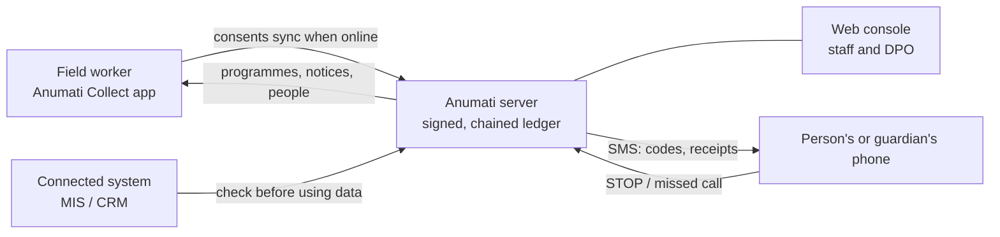
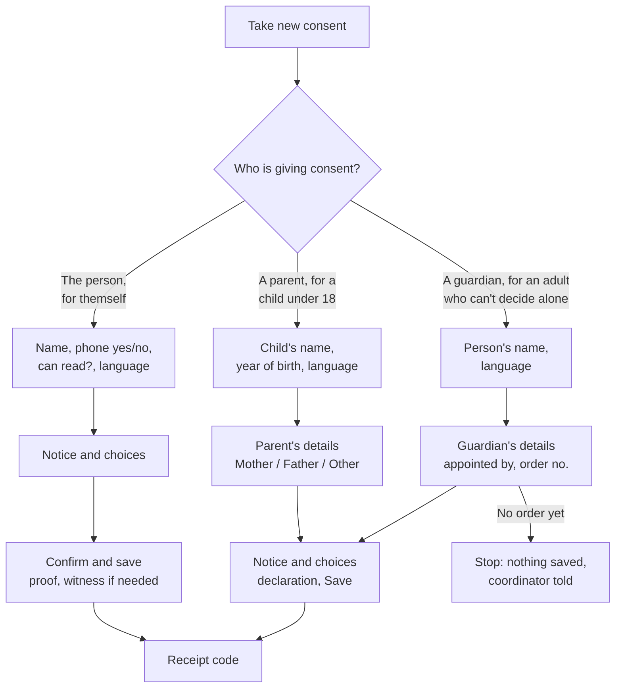
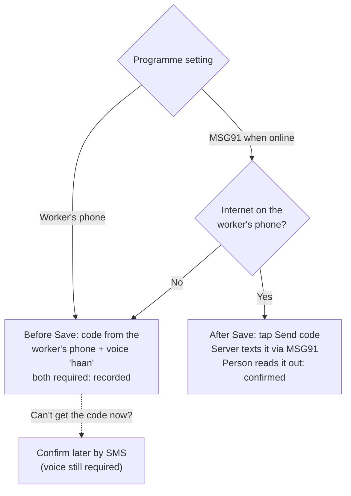
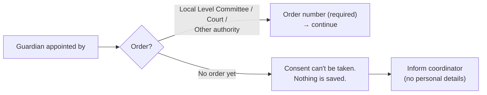
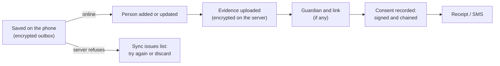
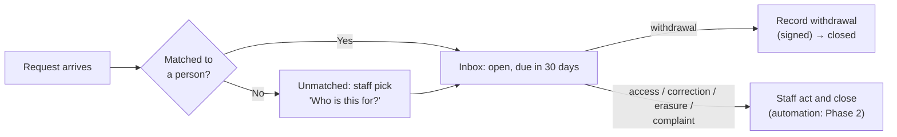
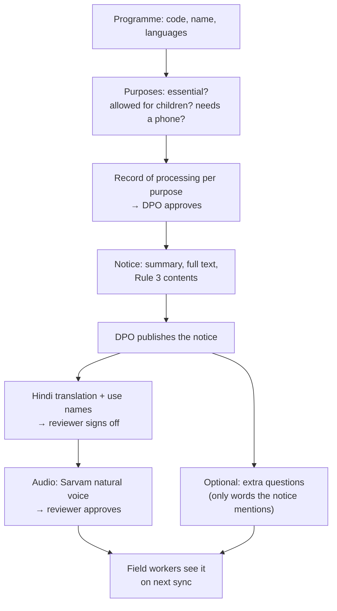
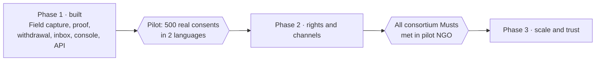

# Anumati product guide

Anumati helps NGOs take, prove and honour consent under India's DPDP Act 2023, including in the field: offline, in Hindi or English, and for people who can't read or have no phone. **Phase 1 is built** and ready for a pilot of about 500 real consents. Phases 2 and 3 are planned.

> This guide lives in the `anumati` repository (`docs/guide/`). Every pull request that changes behaviour updates it, so the published copy always matches what is merged.

## Contents

1. [The three parts](#the-three-parts)
2. [Who uses it](#who-uses-it)
3. [What Phase 1 gives each person](#what-phase-1-gives-each-person)
4. [Taking consent in the field](#taking-consent-in-the-field)
5. [After consent](#after-consent)
6. [Web console journeys](#web-console-journeys)
7. [Roadmap: Phase 2 and Phase 3](#roadmap-phase-2-and-phase-3)
8. [Setup still needed](#setup-still-needed)
9. [Glossary](#glossary)

## The three parts

| Part | Who uses it | What it does |
| --- | --- | --- |
| **Anumati Collect** (Android app) | Field workers | Plays the notice, records choices and proof, works offline, syncs later |
| **Web console** (Frappe Desk) | Programme managers, DPO, operators, admins | Programmes, notices, beneficiaries, requests inbox, reports, settings |
| **APIs** | Connected systems (MIS, CRM) | Record consent, check consent before using data, add or update beneficiaries |

Every consent is signed and chained, so any later change shows up. Names, phone numbers and evidence (voice, photos) are stored encrypted, and phone numbers are looked up by a salted hash, never in plain text.

## Who uses it

| Persona | Where | Main jobs |
| --- | --- | --- |
| **Field worker** | App | Take consent, log a withdrawal or request, add a use later, find a person, sync |
| **Beneficiary** (the person) | In person, SMS | Hear the notice, choose each use, read back a code, withdraw any time |
| **Parent or guardian** | In person, SMS | Consent for a child under 18, or for an adult who can't decide alone |
| **Programme manager** | Web console | Set up programmes, choose extra questions, watch the dashboards, get coordinator alerts |
| **DPO** (Data Protection Officer) | Web console | Publish notices, approve translations and audio, work the requests inbox, verify the chain |
| **Operator** | Web console | Work the requests inbox, match requests to people |
| **Admin** | Web console | Settings, users and roles, SMS account, field phones |
| **Connected system** | API | Ask "may I use this person's data for this purpose?" before using it |

Each role sees only its own menus. A field worker can't open the web console at all; they work only in the app.

## What Phase 1 gives each person

### Field worker (Anumati Collect)

| Feature | What it means on the ground |
| --- | --- |
| Sign in with organisation address, user and password | One-time set-up per phone; then a PIN locks the app |
| Choose programme | Village Health Camps, After-school Learning Centres, Women's Self-Help Groups in the demo |
| **Take new consent** in 3 screens | Who is consenting → notice and choices → confirm and save (guardians: who → guardian → notice and save) |
| Notice in Hindi or English | A reviewed recording (natural voice by Sarvam AI) or the phone's own voice; choices unlock only after it has played |
| Uses in the person's language | Use names show in Hindi when the notice is in Hindi |
| Uses that need a phone hidden | For someone without a phone, uses like "follow-up calls" are not offered |
| Proof that fits the person | SMS code, voice "haan", signature or thumbprint photo, witness: see the [proof table](#proof-and-witness) |
| Guardian journeys | Parent for a child; guardian with an appointment order for an adult who can't decide alone |
| "No order yet" stop | Nothing is saved; the coordinator is told, without the person's details |
| Extra questions | "About the person" screen, only when the programme switches questions on |
| Receipt code | A code like `AN-7K2Q9C` to write on the slip; optional SMS receipt from the worker's phone |
| Server-sent code | After Save, online: the server texts a code to the person's phone; the worker never sees it |
| **Log withdrawal or request** | In person, paper slip or letter: stop all optional uses, stop one use, see or correct data, delete data, complaint |
| **Ask for one more purpose** | A later visit: only the new use is asked; past choices are not asked again |
| **Find beneficiary** | Offline search by name, ID or receipt code; shows each use's status |
| Offline first | Everything is saved on the phone (encrypted) and syncs when online; no duplicates even if sync is cut off |
| Lost phone | Admin marks it lost; the phone wipes itself on its next contact |

### Beneficiary and guardian

- Hears the whole notice before choosing; every optional use starts **off**; "Yes to all" and "No to all" carry equal weight.
- Gets a receipt code and can withdraw any time: tell any field worker, show the paper slip, or (once an inbound number is set up) SMS `STOP <code>` or give a missed call.
- A child's guardian gets the messages, and a guardian's phone number also finds the child's record.

### Programme manager, DPO, operator, admin (web console)

| Area | Phase 1 features |
| --- | --- |
| **Today** dashboard | Consents in the last 30 days, confirmed vs recorded, waiting to sync, withdrawals, open requests, "Needs attention" list |
| **Beneficiaries** | Search by whole-word name, full phone number, receipt code or ID (names stay encrypted); consent history per person; guardians; "Turned 18: renew consent" list |
| **Programmes** | Purposes (with "allowed for children" and "needs a phone"), verification methods, **How SMS codes are sent**, extra questions, withdrawal channels, field phones |
| **Notices and compliance** | Notice versions with a publishing workflow, Rule 3 checklist, translations with reviewer sign-off, audio approval, records of processing (ROPA), breach log, audit log |
| **Requests inbox** | Every withdrawal or rights request with a due date (30 days by default), a board view, one-click "Record withdrawal" |
| **Analytics** | Consents per week, by purpose, by capture mode, by how the notice was given, by language, by worker |
| **Extra questions** | A library of 20 questions (sensitive ones flagged); totals-only report (counts under 5 hidden) |
| **Access logs** | Every view of a name, phone or evidence file is logged |
| **Setup** | Organisation, DPO, languages, signing key, Sarvam voice, SMS account, onboarding checklist |

### Connected systems (API)

| API | Purpose |
| --- | --- |
| `consent.check` | Allow or deny one purpose for one person, from cache in milliseconds |
| `consent.record`, `consent.withdraw`, `consent.state` | Record and read consent from another system |
| `principal.upsert` | Add or update a person (with extra-question answers and year of birth) |
| `notice.get_active` | The live notice, its translations and extra questions |
| `notifications.feed` | A polling feed of consent and request events |
| `consent.verify`, `consent.public_keys` | Anyone can verify a receipt's signature without seeing personal data |

Full details: [`docs/api.md`](https://github.com/sunandan89/anumati/blob/main/docs/api.md) and `anumati/public/openapi.json`.

## Taking consent in the field

### Who is consenting decides the journey

Screen 1 asks **who is giving consent** first. Everything else follows from that answer.

If the programme has switched on extra questions, an **About the person** screen appears after the choices.

### The four journeys

| Journey | Screens | Proof | Witness |
| --- | --- | --- | --- |
| **A. Reads, has a phone** | Who → Notice and choices → Confirm | SMS code (from the server, or the worker's phone plus voice "haan") | No |
| **B. Needs help reading, or no phone** | Who → Notice and choices → Confirm | Voice "haan" or thumbprint / signature photo (at least one) | Yes, if the notice was read to them |
| **C. Parent for a child** | Who → Parent's details → Notice, choices and Save | SMS code to the parent; ID photo only if the parent has no phone | No |
| **D. Guardian for an adult who can't decide alone** | Who → Guardian's details → Notice, choices and Save | Order number (required), SMS code to the guardian; order and ID photos optional | No |

### Proof and witness

| Reads the notice? | Has a phone? | Proof | Witness |
| --- | --- | --- | --- |
| Yes | Yes | SMS code | No |
| Yes | No | Voice "haan" **or** photo of signature / thumbprint | No |
| Needs help | Yes | SMS code **and** voice "haan" or thumbprint | Yes (name required, relation optional) |
| Needs help | No | Voice "haan" or thumbprint | Yes |
| Parent or guardian | Guardian's phone | SMS code to the guardian | No |
| Parent or guardian | No phone | Photo of the guardian's ID | No |

A witness is asked only when someone else read the notice to the person, because an independent person then confirms it was read fairly.

### How the SMS code is sent

One programme setting, **How SMS codes are sent**, decides the route. The app also checks for internet by itself; the worker never chooses.

| | MSG91 (server) | Worker's phone |
| --- | --- | --- |
| Needs internet | Yes, on the worker's phone | No, only mobile signal |
| Cost | About ₹0.2 per SMS | Free |
| Worker sees the code | Never | Yes, so a voice "haan" is always required with it |
| Status | **Confirmed** when the code matches | **Recorded** (the voice is the strong proof) |

### Adult who can't decide alone, with no appointment order

A person with a disability who **can** decide with support consents for themself (journey B).

### Children and turning 18

- Purposes marked "not allowed for children" (for example anonymised research) are never offered for a child.
- The child's **year of birth** is recorded. The server works out when they turn 18; a daily job flags them, and their guardian's consent stops counting ("renewal due") until they consent themselves. The field action for this renewal is in Phase 2.

## After consent

### Receipt and confirmation

1. The app shows the receipt code to write on the slip.
2. With the MSG91 route online, the worker taps **Send code**; the code goes to the person's (or guardian's) phone; they read it out; the consent becomes **confirmed**.
3. Optional: **Send receipt by SMS** opens the worker's SMS app with the receipt text.

### Sync

Each step can be repeated safely: a sync cut off halfway resumes without duplicates.

### Withdrawal and requests

| How it arrives | Phase 1 | What happens |
| --- | --- | --- |
| Told to a field worker | Yes | "Log withdrawal or request" on the phone; a withdrawal takes effect on the phone at once |
| Paper slip or letter | Yes | Same screen, with the slip number |
| SMS `STOP` / `STOP <code>` | Built; needs an inbound number | Withdraws optional uses; ambiguous ones go to the inbox |
| Missed call | Built; needs a missed-call number | Opens a withdrawal request in the inbox |
| Staff in the web console | Yes | "Record withdrawal" on the request: one signed withdrawal, request closed |

### Add a use later

When a programme adds a new use, the worker opens **Ask for one more purpose**, picks the person, reads only the new part of the notice, and records Yes or No. Past decisions are shown and not asked again. Proof follows the same SMS code rules; a witness is asked if the person needs help reading.

## Web console journeys

### Set up a programme

Rules the console enforces:

- A notice can't be published until every purpose has an approved record of processing and all Rule 3 contents are filled in.
- A machine-made translation or recording is never shown in the field until a person reviews it.
- An extra question can be switched on only if the published notice mentions it (for example "occupation"). Sensitive ones (caste, religion, disability, pregnancy) show a warning.
- A guardian other than a parent can't be saved without the order number.

### Work the requests inbox

1. Open **Today** or **Requests board**; overdue requests are highlighted.
2. Open a request; if unmatched, use **Who is this for?** to pick the person.
3. Withdrawal: **Record withdrawal**. Other types: act, write the resolution, close.

### Reports and audit

- Analytics charts update from live data.
- **Extra questions: totals** shows counts only, never one person's answers; counts under 5 show as "fewer than 5".
- **Chain verify** checks that no consent record has been changed.
- Access log and record views show who opened names, phones or evidence.

## Roadmap: Phase 2 and Phase 3

### Phase 2: rights and channels

| Feature | What it adds |
| --- | --- |
| **Renew at 18** in the app | The person who turned 18 consents on their own record; no duplicate person |
| **ODK connector** | Open Anumati's consent screens from inside an ODK / Kobo form; the survey goes ahead only with consent |
| **Self-service page** | People see and change their own choices from a link |
| **Withdrawal over WhatsApp, IVR and email** | More ways to withdraw, each as easy as giving consent |
| **Access, correction and erasure carried out** | Data export for access requests; erasure fanned out to every connected system, with acknowledgements |
| **Retention and purge** | Data deleted automatically when a purpose's retention period ends, with advance notice |
| **Re-consent and catch-up campaigns** | When a notice changes materially, or for older records collected before consent |
| **Partner (processor) routing** | Withdrawals and erasures passed on to partners, with tracking |
| **Frappe / mGrant client** | Check consent from other Frappe apps |

### Phase 3: scale and trust

| Feature | What it adds |
| --- | --- |
| **Breach notification** | Work out who is affected, message each person in their language, prepare the Data Protection Board report, warn staff as the 72-hour deadline nears |
| **22 Indian languages** | Shared language pack with reviewed translations and audio |
| **Audit pack and evidence certificate** | Exportable PDF + JSON + chain proof; legal evidence certificate (BSA s.63) |
| **CommCare connector and web widget** | Consent inside CommCare apps and websites |
| **External security test** | Independent penetration test |
| **Hosted multi-tenant operations, self-host docs** | Many NGOs on one platform; documentation for running it yourself |

## Setup still needed

| Item | Who | Status |
| --- | --- | --- |
| Deploy the latest code on Frappe Cloud | Admin | After every merge |
| MSG91 Auth key in the site config (`msg91_auth_key`) | MSG91 account owner | Pending; until then codes go from the worker's phone with a voice "haan" |
| Real user accounts; remove the demo password | Admin | Before the pilot |
| MSG91 receipt templates (6 texts drafted) | MSG91 account owner | Optional |
| Inbound number for SMS STOP and missed calls | Admin | Optional |
| Hindi review by a native speaker | Programme team | Later |

## Glossary

| Term | Meaning |
| --- | --- |
| **DPDP** | India's Digital Personal Data Protection Act 2023 and its Rules |
| **Notice** | What the organisation tells people: what data, why, for how long, their rights, how to withdraw |
| **Purpose / use** | One reason data is used (health screening, photos, research); chosen one by one |
| **Essential purpose** | Needed for the service; explained, never a toggle |
| **Receipt code** | `AN-` plus 6 characters, printed on the slip; used to withdraw |
| **Recorded / confirmed** | Recorded = saved with proof; confirmed = the person's phone was verified by a server-sent code or a delivered SMS |
| **Evidence only** | No phone: the voice or photo is the proof |
| **ROPA** | Record of processing for each purpose, approved by the DPO |
| **Rule 3** | The DPDP Rule listing what every notice must say |
| **Local Level Committee** | The National Trust body that can appoint a guardian for an adult who can't decide alone |
| **Chain** | Each consent record carries the hash of the one before, so any change breaks the chain |
